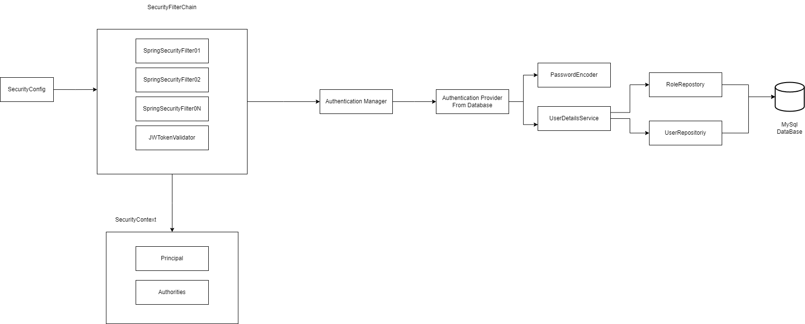
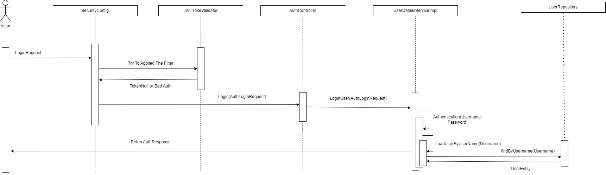

## Login Microservice 

This is the Login Microservice for Zstrong Application, this microservices is bases on Spring Security where:

We have added a new filter to the filter chain called JWTokenValidator. This filter validates if the user is authenticated. If the user is not authenticated, they can authenticate through an Authentication Manager, which uses a DAOProvider to retrieve the user from the database. Alternatively, users can log in and create a token that follows this:

If the user does not exist, a new user can be created following this data flow:

## Recommendations

To start this project, it should be configurete a mysql Database, and chage the name in the application.Propertis, once this done, just use ./gradlew bootRun.